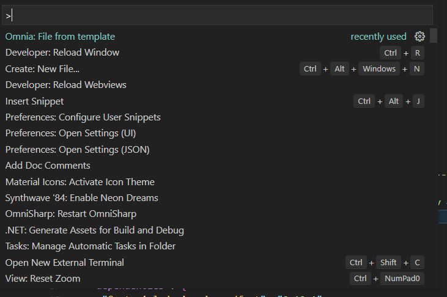
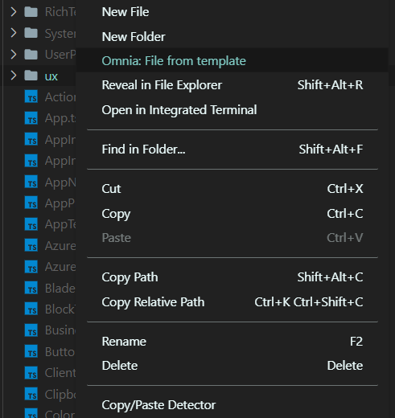

# VsCode OmniaFx Tooling

Extends Visual Studio Code with features to make [OmniaFx](https://fx.omniacloud.net) development a breeze

## Features

Create new files based on best practice templates using the command palette or by right clicking a folder

## Requirements

Omnia Cli 6.* must be installed

Templates targeted the specific major version of Omnia must be installed using: "omnia dev new -i ReplaceWithMajorVersion.0.0 -f"

## Release Notes

### 0.0.1

Initial release with support for creating files using item templates
